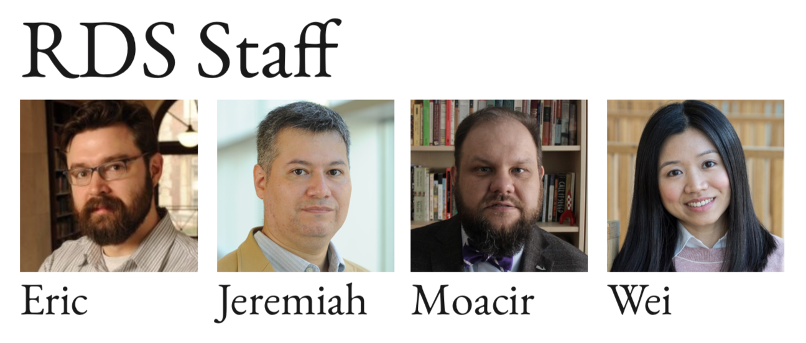
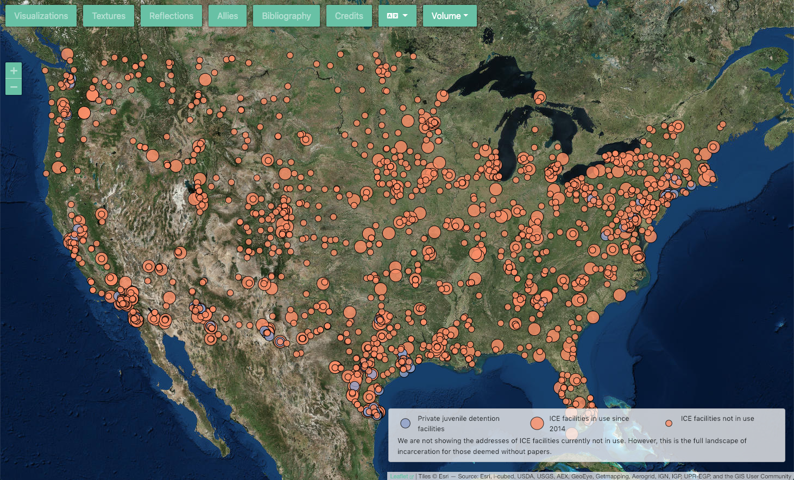
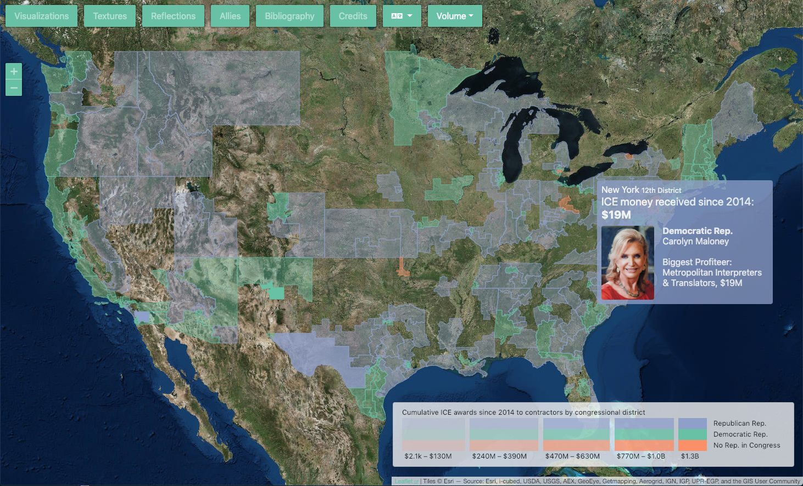
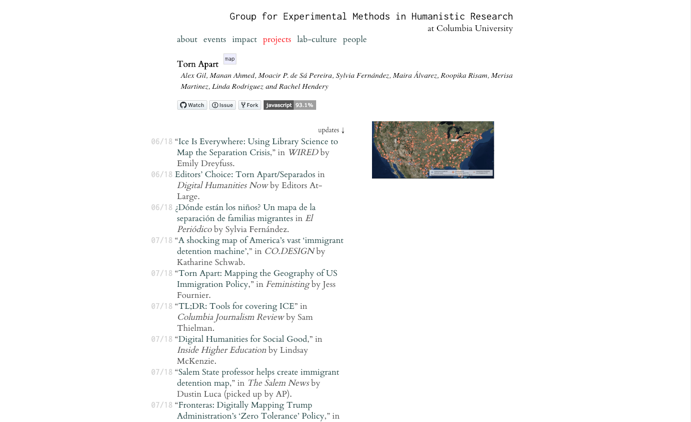

# Data Management in *Torn Apart / Separados*

<small><a href="http://moacir.com">Moacir P. de Sá Pereira</a> / <a href="http://twitter.com/muziejus">@muziejus</a> 
Research Data Librarian <a href="http://library.columbia.edu">Columbia University Libraries</a> 
moacir.p@columbia.edu 
NY, NY, 11 December 2018</small>

Note: Thanks all for coming, and thanks for the introduction. Today I’m going
to be talking about something I did before coming to Columbia--I’ve only been
here since the beginning of October, but something that has nevertheless been
imbued with a certain spirit of the Columbia Libraries that I want to press
home today. 

---

## Research Data Services (SESSL)

Note: But first a bit about me. I’m part of Research Data Services, which is
itself part of SESSL, the Science, engineering, and social sciences libraries
division. Here I am with my co-workers. This is taken from a document we put
together this week to hang in Lehman 215, which is where we host, four times a
week, a mix of office hours and open lab, where students and faculty can come
to work on their digital, data-driven research projects or ask for
consultation on the projects. Typically, they do a healthy mix of
both--supervised and unsupervised work. Our areas of strength are consulting
on data management and use in R, Python, and GIS, but we also consult on other
statistical software packages and, with my arrival, have begun consulting on
web development and JavaScript. Lehman 215 is a great space where lots of work
gets done every afternoon. But that’s enough about me and RDS. Let’s move on
to Torn Apart.

---

## Torn Apart / Separados

<h3>Volume 1</h3>
<ul>
<li>Manan Ahmed</li>
<li>Maira E. Álvarez</li>
<li>Sylvia A. Fernández</li>
<li>Alex Gil</li>
<li>Merisa Martinez</li>
<li>Roopika Risam</li>
<li>Linda Rodriguez</li>
<li>Moacir P. de Sá Pereira</li>
</ul>

<h3>Volume 2</h3>
</h3>
<ul>
<li>Manan Ahmed</li>
<li>Maira E. Álvarez</li>
<li>Sylvia A. Fernández</li>
<li>Alex Gil</li>
<li>Rachel Hendery</li>
<li>Roopika Risam</li>
<li>Moacir P. de Sá Pereira</li>
</ul>

<small style="font-size: 30%;">With: Alex Ahmed, Gaiutra Bahadur, Christina Boyles, Isis Campos, Maria
Sachiko Cecire, Cole D Crawford, Cathy Davidson, Emily Esten, Noreen Farooqui,
Alex Galarza, Lorena Gauthereau, Erin Glass, Tassie Gniady, Elizabeth Grumbach,  Nicole M.
Guidotti-Hernández, Juliet Louise Hardesty, Kathi Inman Berens, Patrick Juola,
Anna Kijas, Clément Lévy, Purdom Lindblad, Brandon Locke, Kathryn McDonald,
Kristen Mapes, Vinicius Marquet, Jodi Mikesell, Durba Mitra, Chelsea Miya,
Bethany Nowviskie, Gregory Palermo, Dimitris Papadopoulos, Andrew Petersen,
Rubria Rocha, Brian Rosenblum, Danica Savonick, Megan Finn Senseney, Erik
Simpson, Juan Steyn, Zachariah Stern,
Angelika Strohmayer, Lisa Tagliaferri, Toniesha L.  Taylor, Bharat Jayram
Venkat, Paola Verhaert,
Carolina Villarroel, Jacqueline Wernimont, Vika Zafrin, Annette Zapata
</small>

Note: Before continuing, however, I must acknowledge the labor that went into
the two volumes of Torn Apart Separados, especially that of Linda Rodriguez,
who passed away during the production of the second volume. As you can see,
with the contributors listed, it’s effectively impossible to fit everything
into a single slide. But I believe this also reveals an important aspect of
the project. We see listed here people from institutions of varying sizes,
from around the world, and in various positions within the academic community.
Graduate students, librarians, and faculty all collaborated intensely on this
project over the summer.

---

Note: The first volume of Torn Apart was put together in a week and we
described it as “A rapidly deployed critical data & visualizations
intervention the USA’s 2018 Zero Tolerance Policy for asylum seekers at the US
ports of entry and the humanitarian crisis that followed.” It featured five
visualizations with one added later that aimed to reveal, among other things,
how everywhere in the US has become a borderland, patrolled by ICE or
Immigration and Customs Enforcement. Much of the data on juvenile detention
facilities was collected by our team, but we also relied on a data dump of
information from ICE itself, made available because of a FOIA request.

---

Note: The second volume presents itself as “a deep and radically new look at
the territory and infrastructure of ICE’s financial regime in the USA. This
data and visualization intervention peels back layers of culpability behind
the humanitarian crisis of 2018.” Because the primary dataset in these five
visualizations was a list of 30,000 government contracts, making sense of it
all took much longer. Additionally, coincidentally, we ran into unexpected
issues regarding data management.

---

## Data Management in Torn Apart / Separados

Note: I say coincidentally, because just as the data management crises were
asserting themselves in volume 2, I was interviewing for my position here, for
which data management is a central concern. And when I arrived here and was
asked to talk about Torn Apart in my first week of employment, it seemed
obvious for me to focus on the data management aspect of it.

---

## http://xpmethod.plaintext.in/torn-apart

Note: But now I’ve been here for a while, and I want to talk about aspects of
this project that are more important to the mission of the Libraries. First, I
start with the url for Torn Apart. The project sits beneath the webpage for
xpmethod

---

Note: XPMethod is the Group for Experimental Methods in Humanistic Research,
here at Columbia. And a lot of the XPMethod ethos of mobilized humanities,
visible labor, and so on informs the project. XPMethod has also kept track of
the considerable amount of press the project has received.

---

## Torn Apart / Separados

<h3>Volume 1</h3>
<ul>
<li>Manan Ahmed</li>
<li>Maira E. Álvarez</li>
<li>Sylvia A. Fernández</li>
<li>Alex Gil</li>
<li>Merisa Martinez</li>
<li>Roopika Risam</li>
<li>Linda Rodriguez</li>
<li>Moacir P. de Sá Pereira</li>
</ul>

<h3>Volume 2</h3>
</h3>
<ul>
<li>Manan Ahmed</li>
<li>Maira E. Álvarez</li>
<li>Sylvia A. Fernández</li>
<li>Alex Gil</li>
<li>Rachel Hendery</li>
<li>Roopika Risam</li>
<li>Moacir P. de Sá Pereira</li>
</ul>

<small style="font-size: 30%;">With: Alex Ahmed, Gaiutra Bahadur, Christina Boyles, Isis Campos, Maria
Sachiko Cecire, Cole D Crawford, Cathy Davidson, Emily Esten, Noreen Farooqui,
Alex Galarza, Lorena Gauthereau, Erin Glass, Tassie Gniady, Elizabeth Grumbach,  Nicole M.
Guidotti-Hernández, Juliet Louise Hardesty, Kathi Inman Berens, Patrick Juola,
Anna Kijas, Clément Lévy, Purdom Lindblad, Brandon Locke, Kathryn McDonald,
Kristen Mapes, Vinicius Marquet, Jodi Mikesell, Durba Mitra, Chelsea Miya,
Bethany Nowviskie, Gregory Palermo, Dimitris Papadopoulos, Andrew Petersen,
Rubria Rocha, Brian Rosenblum, Danica Savonick, Megan Finn Senseney, Erik
Simpson, Juan Steyn, Zachariah Stern,
Angelika Strohmayer, Lisa Tagliaferri, Toniesha L.  Taylor, Bharat Jayram
Venkat, Paola Verhaert,
Carolina Villarroel, Jacqueline Wernimont, Vika Zafrin, Annette Zapata
</small>

Note: But I return to this list. And I note to myself how many of the names
here have been involved at the Friday Open Lab here in Butler Library, as part
of the Studio@Butler. Many have come as invited guests or have just dropped
in. I myself am part of that second group, having started coming with regular
frequency since my first few months at my previous job at NYU.

While XPMethod, then, hosts Torn Apart/Separados, and while the work was done
mostly over google docs and chatting on telegram, it relied in part on bonds
forged and strengthened in the Studio. And that’s what I’d really like to talk
about with the rest of my time. Maybe the data management aspects can come up
in discussion afterward.

---

## Studio / Open Lab Ethos in Torn Apart / Separados

1. Collaboration

Note: I’ve already mentioned how central collaboration was to Torn Apart, but
this is true of most work that happens in the studio and, of course, in
Libraries as a whole. Unlike the romantic and grotesque fantasy of a graduate
student or professor locked in a garret in solitary confinement until they
descend with their genius, we in the Libraries know that collaboration is
central to any sort of knowledge production. 

---

## Studio / Open Lab Ethos in Torn Apart / Separados

1. Collaboration
2. Ethics

---

## Studio / Open Lab Ethos in Torn Apart / Separados

1. Collaboration
2. Ethics
3. FAIRness (Findable, Accessible, Interoperable, Reusable)

---

## Studio / Open Lab Ethos in Torn Apart / Separados

1. Collaboration
2. Ethics
3. FAIRness (Findable, Accessible, Interoperable, Reusable)
4. Sustainability

---

## Thanks!
#### [http://moacir.com/talks/torn-apart-libraries/](http://moacir.com/talks/torn-apart-libraries/)
##### [@muziejus](http://twitter.com/muziejus) / moacir.p@columbia.edu
